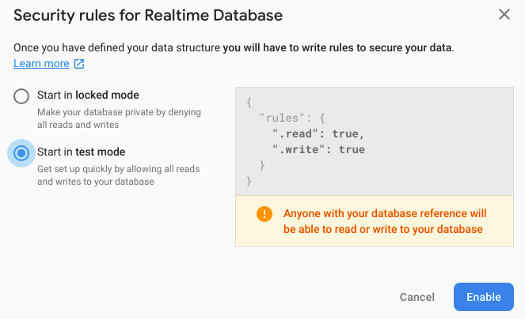

# Laravel Firebase
A simple project on how to setup Firebase with Laravel.

## Requirements
- AMPPS, WAMP, XAMPP or MAMP (Optional)
- Homestead (Recommended)
- Composer 1.6.5
- PHP 7.2.7

## Getting started
- Copy `.env.example` to `.env`
- Run `composer install` or `php composer.phar install` to install required packages
- Run `php artisan key:generate` to create application key
- Run `php artisan storage:link` to create a symbolic link from "public/storage" to "storage/app/public"

## Setup Firebase
Let’s start with signing up for a Gmail account. In the next tab, open the [Firebase page](https://firebase.google.com/) for database settings and click the **GO TO CONSOLE** button.

### Step 1

Next, in the next window, create a database project and provide information including project name. When done, click the **Create Project** button.

### Step 2

Wait for the project to be created and then continue. You will be automatically redirected to the **Firebase Dashboard**.

### Step 3

After successfully creating the project, go to the **Database** tab, click **Rules** to update read and write rules to **true** and then click the **Publish** button.

### Step 4

Click the **User and permissions** tab.

### Step 5

Next, click **Service account** and then click the **Create Key** button

### Step 6

Save json file to **storage/app/public/json/**.

### Step 7

Copy Realtime Database link to controller.

### Step 8

### Step 9

Run your application to see the output in action.

### Step 10

## References
- [Connect Firebase Realtime Database in Laravel](https://www.cloudways.com/blog/firebase-realtime-database-laravel/)